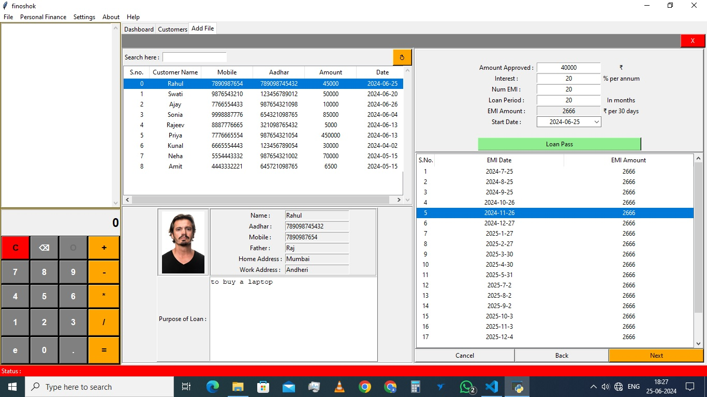
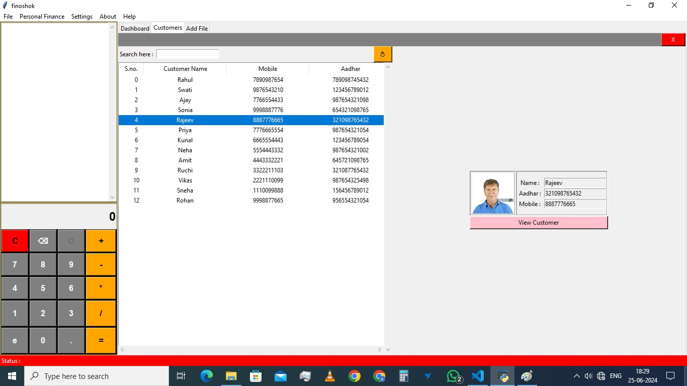
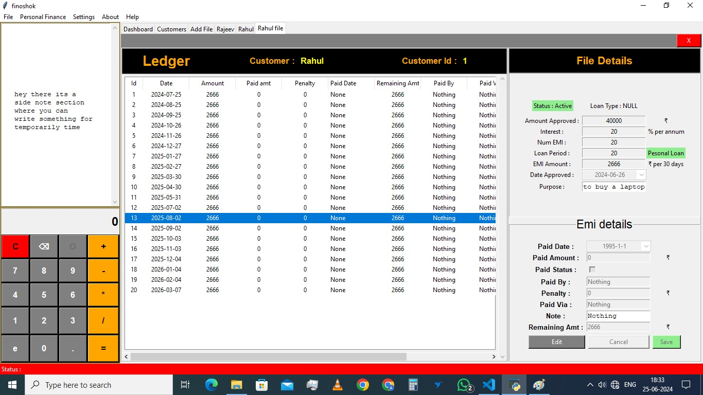
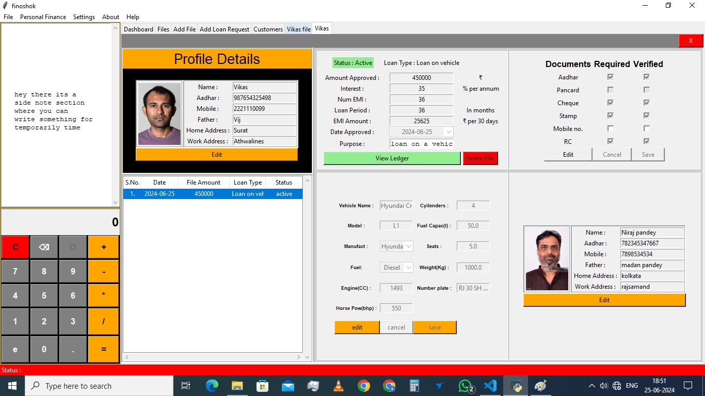
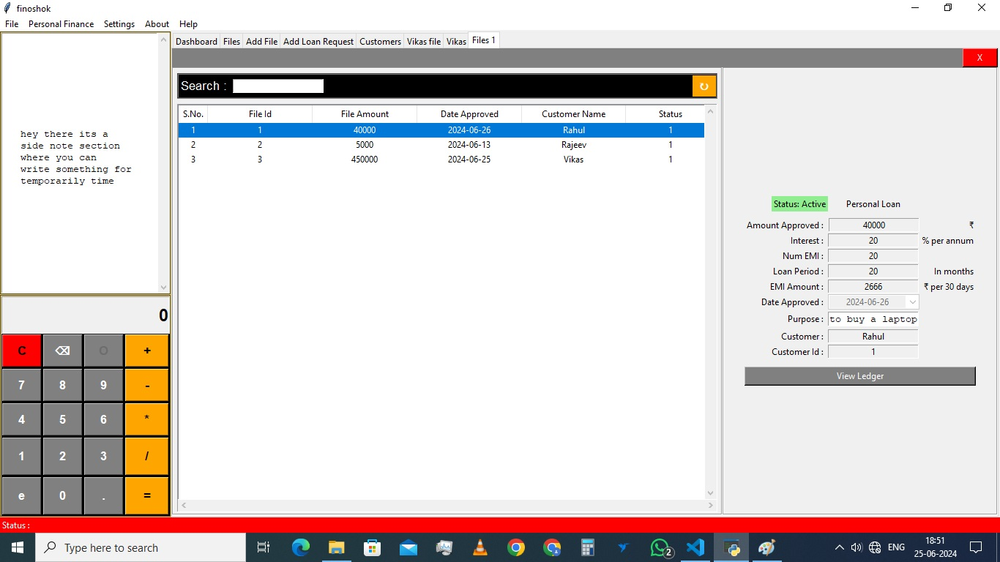

# FinoShok

FinoShok is a comprehensive microfinance software solution designed to streamline the financial operations of microfinance institutions. It facilitates efficient loan processing, repayment tracking, interest calculation, and detailed financial reporting.

## Features

- **Loan Processing:** Simplify loan application and approval processes.
- **Repayment Tracking:** Track repayments efficiently and accurately.
- **Interest Calculation:** Automated and precise interest calculations.
- **Reporting Tools:** Generate detailed financial reports to monitor performance.

## Screenshots













## Installation

To get started with FinoShok, follow these steps:

1. **Clone the repository:**
   ```bash
   git clone https://github.com/yourusername/finoshok.git
   cd finoshok


1. Install dependencies: Ensure you have Python installed, then install required dependencies.

In cmd type : 

```bash
    pip install -r requirements.txt
```

2. Setup the application: Execute the setup.py file one time only to initialize the application.
   ```bash
   python setup.py
   ```
3. Install mysql if not already installed.

4. Set the username, password, and port in databaseConfig.py file located in config folder

5. Run the application: Start the application by executing main.py.python main.py

## Usage

Loan Processing: Navigate to the loan section to handle loan applications.

Repayment Tracking: Use the repayment section to monitor and record repayments.

Interest Calculation: Automatically calculate interest using the built-in calculator.

Reporting Tools: Generate financial reports from the reports section.

Contribution: 

We welcome contributions to FinoShok! Please follow these steps to contribute:

Fork the repository.Create a new branch (git checkout -b feature-branch).Commit your changes (git commit -am 'Add new feature').Push to the branch (git push origin feature-branch).Create a new Pull Request. ContactFor any inquiries or support, please contact us at yashrajkumawat7357@gmail.com . 

Thank you for using FinoShok!

This `README.md` provides a comprehensive overview of your microfinance software, including features, installation instructions, usage, contributing guidelines, and contact information. Feel free to adjust the details, especially the repository URL and contact information, to match your specific project setup.
